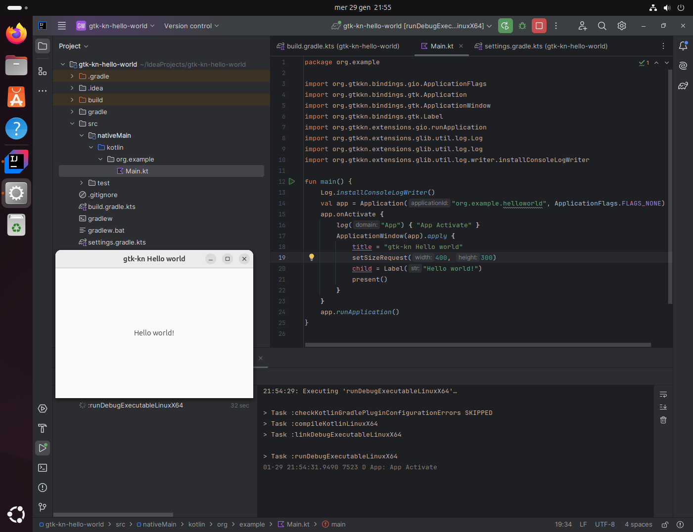

This guide will help you set up gtk-kn and run a Hello World GTK application using IntelliJ IDEA on Linux and macOS.

For detailed installation steps, refer to the [Developer Guide](../developer-guide/index.md).

---

## Prerequisites

### Install System Dependencies

#### Linux

```sh
sudo apt install libgirepository1.0-dev libadwaita-1-dev
```

#### macOS ([Homebrew](https://brew.sh/))

```sh
brew install pkgconf libadwaita
```

### Install IntelliJ IDEA

Download and install [IntelliJ IDEA (Community Edition is fine)](https://www.jetbrains.com/idea/download/).

---

## Setting Up the Project

### Create a New Kotlin Project

- Open **IntelliJ IDEA**.
- Create a new **Kotlin project**.
- Set **Build System** to **Gradle** (leave other options as default).

### Configure Gradle

Replace the content of **`settings.gradle.kts`** (this step won’t be needed once the artifacts are published on
**MavenCentral** and **Gradle Plugin Portal**):

```kotlin
pluginManagement {
    repositories {
        gradlePluginPortal()
        mavenCentral()
        maven(url = "https://s01.oss.sonatype.org/content/repositories/snapshots/")
    }
}

dependencyResolutionManagement {
    repositories {
        mavenCentral()
        maven(url = "https://s01.oss.sonatype.org/content/repositories/snapshots/")
    }
}
```

Replace the content of **`build.gradle.kts`**:

```kotlin
plugins {
    kotlin("multiplatform") version "2.1.0"
    id("org.gtkkn.application") version "0.0.3-SNAPSHOT"
}

gtkKn {
    entryPoint = "org.example.main"
    targetLibraryVersions.putAll(mapOf("gio" to "2.28", "gtk" to "4.10"))
}

kotlin {
    sourceSets {
        nativeMain {
            dependencies {
                implementation("org.gtkkn:gtk4-${gtkKn.platformSuffix.get()}:0.0.3-SNAPSHOT")
            }
        }
    }
}
```

---

## Writing the Sample Application

### Create the Project Structure

- **Delete** the default `src/main/` directory.
- **Create** the following directory:
  ```
  src/nativeMain/kotlin/org/example/
  ```

### Create `Main.kt`

Inside the newly created `org/example/` directory, create a file named `Main.kt` and add the following code:

```kotlin
import org.gtkkn.bindings.gio.ApplicationFlags
import org.gtkkn.bindings.gtk.Application
import org.gtkkn.bindings.gtk.ApplicationWindow
import org.gtkkn.bindings.gtk.Label
import org.gtkkn.extensions.gio.runApplication
import org.gtkkn.extensions.glib.util.log.Log
import org.gtkkn.extensions.glib.util.log.log
import org.gtkkn.extensions.glib.util.log.writer.installConsoleLogWriter

fun main() {
    Log.installConsoleLogWriter()
    val app = Application("org.example.helloworld", ApplicationFlags.FLAGS_NONE)
    app.onActivate {
        log("App") { "App Activate" }
        ApplicationWindow(app).apply {
            title = "gtk-kn Hello world"
            setSizeRequest(400, 300)
            child = Label("Hello world!")
            present()
        }
    }
    app.runApplication()
}
```

---

## Running the Application

### Option 1: Using IntelliJ IDEA

- Open the **Gradle** tab.
- Under the **Run** group, execute:
    - **`runDebugExecutableLinuxX64`** (for Linux)
    - **`runDebugExecutableMacosArm64`** (for macOS)

### Option 2: Using Terminal

Run the following command:

```sh
./gradlew runDebugExecutableLinuxX64  # Linux
./gradlew runDebugExecutableMacosArm64  # macOS
```

This will open a **GTK Hello World** window. 🎉

<figure markdown>

</figure>

---

This **Get Started** guide provides a **quick setup** to help you run your first **gtk-kn** application.
For more details, check out the [Developer Guide](../developer-guide/index.md). 🚀
